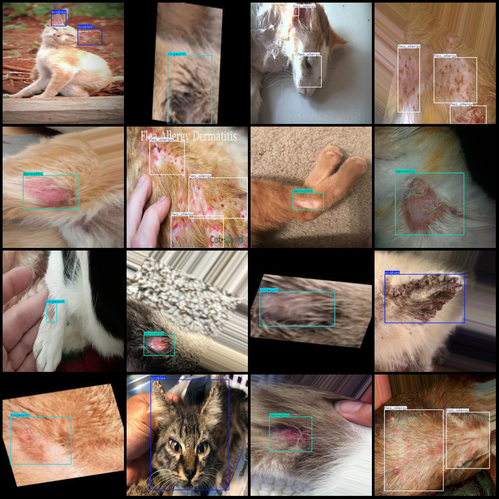
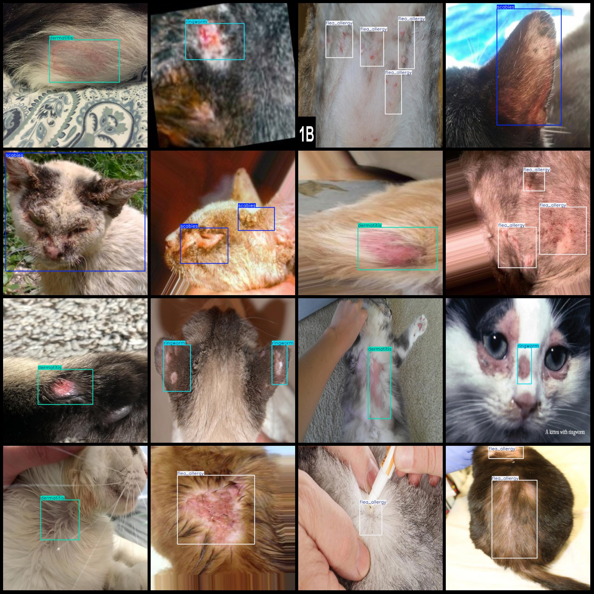

# Pet Cat Skin Disease Detection Dataset (VOC+YOLO Format) - 799 Images in 4 Categories

Dataset format: Pascal VOC format + YOLO format (txt file without split path, only containing jpg images and corresponding VOC format xml files and yolo format txt files). 
Number of images (jpg file count): 799  
Number of annotations (xml file count): 799  
Number of annotations (txt file count): 799  
Number of annotation categories: 4  
Annotation categories names (note that the order of yolo format categories does not correspond with this, but refer to the "labels" folder's "classes.txt"): ["dermatitis", "flea_allergy", "ringworm", "scabies"]  
Box count for each category:  
dermatitis box count = 200
flea_allergy box count = 469
ringworm box count = 203
scabies box count = 260
Total box count: 1132  
Images per category:  
dermatitis images per category = 200
flea_allergy images per category = 200
ringworm images per category = 199
scabies images per category = 200
Image resolution: 640x640  
Annotation tool used: labelImg  
Annotation rules: draw boxes around the categories  
Important note: The dataset does not have a training/validation/test split; it requires manual division.  
Special declaration: This dataset does not guarantee any accuracy for models trained or weight files created using this dataset.  
Image preview:
## Images

Here is a pay link on Stripe ( https://buy.stripe.com/3cs8yP7sY87d0vu9AB ). Please contact me lonlonago@foxmail.com after funding $89, and I will send you a complete data files , thank you!

